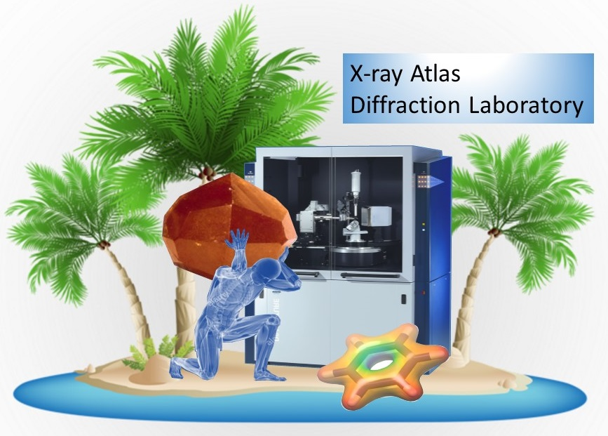
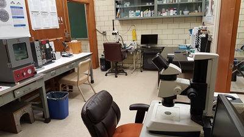
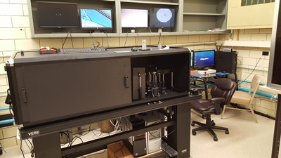
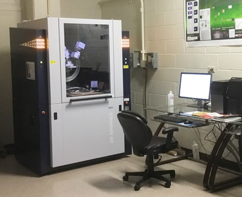
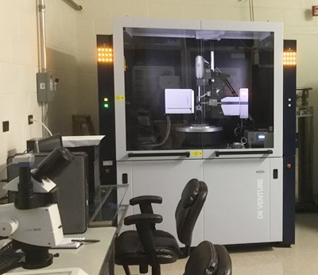

<h2>Lab Safety and Security:</h2>
All personnel, including students, using high-pressure research facilities at HIGP and Argonne National Lab 
is required to undergo formallized safety training. Our Lab Safety and Security website lists these requirements 
and provides access to documents describing safe procedures to operate all of lab interumentation, as well as MSDS 
sheets for all chemicals we use. 
 
<a href="https://pdera.github.io/labsafety.html"> Go to HIGP high-pressure Lab Safety and Security website</a>

<a href="https://pdera.github.io/booking.html">Book X-ray Atlas time</a>
 
<a href="https://www.dropbox.com/s/j9j8sp83tuppmfe/Atlas_all.mp4?dl=0" target="_blank">Video tour of the lab and software</a>
 
<a href="https://www.dropbox.com/s/e3ftcv8bvy04kz4/Brochure%20-%20D8%20QUEST%20VENTURE%20Chemical%20Crystallography%20-%20DOC-B86-EXS008%20low%20en.pdf?dl=0" target="_blank">D8 Venture brochure</a>
 
<a href="https://www.dropbox.com/s/x0v3hk3k0noj9ox/Cryostream-800.pdf?dl=0" target="_blank">Oxford Cryostream 800+ high/low T device brochure</a>
 
<a href="https://www.dropbox.com/s/g2uy2cvzotzwkyv/1%20D8%20Advance%20BR%202012%20rfs%20%281%29.pdf?dl=0" target="_blank">D8 Advance brochure</a>
 
<a href="https://www.dropbox.com/s/z4b6udlsbhk3cq0/1%20D8%20MTC%20TC%20Dome%20PS42.pdf?dl=0" target="_blank">TC Dome heating stage brochure</a>
 
<a href="https://www.dropbox.com/s/yr2938d4xn3s0c5/1%20Diffrac_EVA%20BR.pdf?dl=0" target="_blank">Diffrac.Eva brochure</a>
 
<a href="https://www.dropbox.com/s/8czznxu71sky0ee/1%20Diffrac%2B%20TOPAS%20V4%202011%20BR.pdf?dl=0" target="_blank">Diffrac.TOPAS brochure</a>
 

<h3>Table of Contents:</h3>
[Sample Preparation Lab](#spl)
 
[Raman Spectroscopy Lab](#rsl)
 
[X-ray Atlas Lab](#xal)
 
[Partmership for eXtreme Xtallography](#px2)

The Mineral Physics laboratories at HIGP occupy a space of approximately 3500 sq. ft.
 and house a wide variety of state of the art analytical instrumentation, majority of 
 which has been acquired over the years with generous help from the NSF EAR programs 
 and has been used for conducting advanced research and for student training in high-pressure 
 science. The laboratories are equipped for measurements of physical, chemical, spectroscopic, 
 micro-structural and nano-structural properties of minerals, advanced ceramics and ceramic composites, 
 single-crystalline and poly-crystalline minerals, silicate glasses and melts, and hard thin ceramic 
 films as well as metals and molten alloys. HIGP high pressure labs are not only a truly unique 
 resource for mineral science research and student training within the Hawaiian Islands and central 
 Pacific region, but also one of the largest and most comprehensive academic research facilities 
 in Mineral Physics in the country.
 
<h3>Diamond Anvil Cell Sample Preparation Lab</h3>

The HIGP Mineral Physics lab is well equipped for sample preparation in mineral science research.
 The sample preparation labs have just been renovated. Three modern stereo microscopes with long working 
 distance high magnification objectives and high resolution digital cameras offer capabilities for examining, 
 photographing, and documenting both starting samples, as well as products of HPHT experiments. 
 A high temperature oven is available for sample synthesis or removal of moisture from hygroscopic samples. 
 A laser gasket drilling system and an electric discharge drilling machine (EDM) are also available for 
 drilling sample chambers in gaskets for diamond anvil cell (DAC) experiments. 
 An existing gas loading system is being modified for visual and optical access to the high pressure chamber 
 for more reproducible and reliable gas loading and will be ready for use by our group in the near future.

 

<hl>

<h3>High Pressue and Temperature Raman Spectroscopy Lab</h3>

HIGP spectroscopy lab houses a high-resolution triple-grating Dilor Raman spectrometer with 
a cryogenically cooled CCD detector and long working distance high magnification microscope, 
optimized for experiments with diamond anvil cells at ambient temperature. Spectra Physics Model 
2020 Ar-ion laser supplies the incident light. This instrument has been the working horse of the 
Raman spectroscopy research at HIGP for many years, but is nearing retirement due to mechanical 
and electronic problems. A second custom Princeton Instruments micro-Raman system based on a modern 
Acton SP2360 imaging spectrograph, thermoelectric deeply depleted back illuminated PIXIS CCD detector 
and 1000 mW 532nm solid state laser has just been added. This new system will be coupled by broadband 
fiber optics transport with the Bruker D8 Venture unit of the X-ray Atlas. 

<hl>

<h3>X-ray Atlas Diffraction Lab</h3>

Experiments that allow probing the structure, behavior and physical properties of Earth forming 
minerals at simultaneous high pressure and temperature (HPHT) are one of primary indirect sources of 
information about the deep interior of our planet, indispensable in creating reliable geophysical models. 
Crystallographic, diffraction-based experiments at HPHT play a special role in mineral physics, being the only 
reliable source of information about changes in the crystal structure, which controls and determines physical 
properties of minerals as a function of depth. HPHT experiments with in situ X-ray diffraction are challenging, 
and have traditionally been limited to synchrotron labs. Even at synchrotrons, the more precise and sensitive 
single-crystal experiments, capable of detecting the most subtle structural discontinuities and symmetry changes 
at HPHT have been extremely rare, limiting our ability to probe behavior of more complex silicate minerals at 
realistic mantle conditions. X-ray Atlas is novel state of the art X-ray instrument optimized for in situ 
laboratory-based single-crystal X-ray diffraction experiments in resistively heated diamond anvil cell, capable of 
exploring PT conditions relevant for the Earth upper mantle, transition zone and some of the lower mantle 
(up to 50 GPa and 1000o C, corresponding to depths greater than 1000 km). X-ray Atlas will also provide the much 
needed and currently non-existent X-ray diffraction capabilities for the HIGP high pressure lab and will be 
a valuable resource to a number of geology-focused faculty and students at the University of Hawaii. 
We acuired and are awaiting delivery of a a system composed of two commercial X-ray diffractometers, Bruker D8 Venture 
single crystal instrument, to serve as a base platform for 
development the X-Ray Atlas system, and Bruker D8 Advance high resolution powder instrument. The Venture diffractometer 
will retain its original full functionality after the planned modification, but a range of new unique capabilities 
will be added by (T1) integrating a parallel kinematics hexapod robotic device as an alternative sample mounting 
platform for HPHT diamond anvil cells and thin sections. In addition to the hexapod, we will (T2) incorporate a fiber 
optics transport to the sample viewing system of the Venture diffractometer, which will enable collection of ruby fluorescence 
and Raman signal using an existing standalone Princeton Instruments spectroscopy system, while the sample is mounted on 
the diffractometer. The final instrument modification will be (T3) integration of photodiode detector into the X-ray 
beam stop assembly, which will be utilized for automated X-ray absorption/transmission scanning.

Intellectual Merits: This project is centered around (i) creating unique experimental capabilities that will enable in house 
research focused on crystallographic aspects of mineral physics at conditions that are currently inaccessible to other 
existing in house instruments (ii) creating new scientific opportunities for studying complex mineral systems of geophysical 
or environmental importance, with unprecedented sensitivity to detection of subtle, but possibly important discontinuous 
transformations and unambiguous determination of crystal structures of nonquenchable phases, (iii) enable in house experiments 
relevant to the on-going NSF EAR Geophysics project  EAR 1417024 on metastable transformation of pyroxenes in subducting 
slabs. 
Broader Impacts: Through development of the X-ray Altas we hope to achieve the following: (i)  Create new and very 
exciting opportunities for lab-based mineralogy, petrology and mineral physics undergraduate and graduate education at 
the University of Hawaii (ii) Create a personnel training and new technology prototyping site for two new HIGP-led, 
NSF-funded initiatives COMPRES Technology Center at Argonne (COMPTECH) and Partnership for eXtreme Xtallography (PX^2), 
(iii) Create a testing and prototyping site for the NSF EAR Geoinformatics project EAR 1440005 to develop ATREX – a 
novel data analysis software package for mineral and environmental sciences (iv) Create novel, unique, robust and 
custom-designed technology that could be transferred to other university mineral physics research labs, and will be 
marketed by the commercial instrument vendor, Bruker AXS and (v) Create a university-based training facility for 
students and researchers from other institutions who would like to learn about advanced crystallographic methods in 
mineral sciences. 

<hl>

<h3><a name="px2">Partnership for eXtreme Xtallography</a></h3>

COMPRES has recently funded a new joint project of the University of Hawaii, and GSECARS located at APS 
experimental station 13BM-C, with Dera as PI. Recent upgrade of the monochromator and focusing optics in 
that station allows to extend the experimental capabilities offered at 13BM-C to include powder and single 
crystal diffraction experiments in diamond anvil cell or on diamond inclusions. Unique design combining 
Newport 6-circle diffractometer with laser spectroscopy optics, currently under commissioning, enables single 
crystal X-ray diffraction measurements at combined high pressure and high or low temperature. The PX^2 instrument 
currently offers 30 keV incident energy beam, focused to 15 x 15 μm size, with supplementary imaging system, which 
allows accurate sample monitoring and positioning, ideal for the diamond anvil cell work. Several successful 
commissioning measurements of microcrystal samples in the air, solid inclusions in natural kimberlitic diamonds, as 
well as crystal inside diamond-anvil cell have already been performed. PX^2 has already started accepting general 
users for the 2015-2 APS run. The progress of the development of laser heating HPHT capabilities of this instrument 
will rely on the availability of X-ray Atlas as a prototyping and training instrument in Hawaii.

