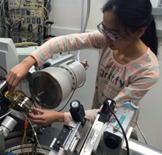
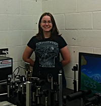
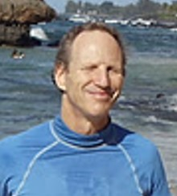
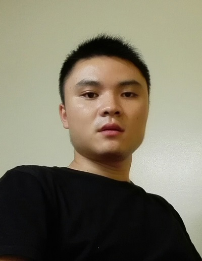
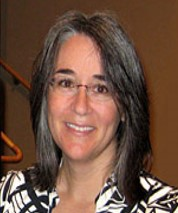

<h3>Table of Contents:</h3>
[Research Scientists](#rs)
 
[Graduate Students](#gs)
 
[Technical and Engineering Staff](#xal)
 
[People who moved on](#mo)

Our group includes students and personnel based on campus, in Honolulu, as well as several scientists working
at the Argonne National Laboratory. Our graduate students are enrolled in degree programs administered through the Department of Geology 
and Geophysics, where Przemek holds a graduate afiliate faculty position. We also employ UHM undergraduates for shorter-term projects, and host visits of 
students from other Universities.  
 
We constantly look for new students, so if you find our research interesting, please contact Przemek by email (pdera@hawaii.edu) to learn about 
employment opportunities. 

<h2>Research Scientists</h2>

<h3>Dr. Dongzhou Zhang, PX^2 Beamline Scientist</h3>

Dongzhou Zhang received his B.S. in physics from Peking University, Beijing, China, in 2008.
He completed his Ph.D. in geophysics under the supervision of Prof. Jennifer Jackson at 
California Institute of Technology, Pasadena, CA, in 2014. He is currently the beamline scientist 
of the Partnership for eXtreme Xtallography program affiliated with the University of Hawaii at 
Manoa and located at the GeoSoilEnviroCARS at Argonne National Laboratory. His research 
interests include physics and chemistry of the planetary interiors, high pressure physics and 
synchrotron based X-ray techniques. He received several awards, including the Chinese 
Government Award for Outstanding Self-Financed Students Abroad (2013) and the American 
Geophysical Union Mineral and Rock Physics Graduate Research Award (2015).

<h3>Dr. Gregory J. Finkelstein, HIGP Mineral Physics Lab Manager</h3>

Greg received his B.S. in chemistry from the Washington University in St. Louis, in 2008.
He completed his Ph.D. in geophysics and materials science under the supervision of Prof. Thomas Duffy at 
Princeton University, in 2014. He is currently the beamline scientist 
of the Partnership for eXtreme Xtallography program affiliated with the University of Hawaii at 
Manoa and located at the GeoSoilEnviroCARS at Argonne National Laboratory. His research 
interests include physics and chemistry of the planetary interiors, high pressure physics and 
synchrotron based X-ray techniques. He received several awards, including the Chinese 
Government Award for Outstanding Self-Financed Students Abroad (2013) and the American 
Geophysical Union Mineral and Rock Physics Graduate Research Award (2015).

 

 

<h2>Postdoctoral fellows</h2>
<h3>Patrick Barnett, Spectroscopy Postdoctoral Fellow</h3>

Yi’s theses research is focused on understanding metastable polymorphism in pyroxene minerals in the context of 
subduction zone modeling. Yi uses advanced crystallographic methods and synchrotron diffraction, as well as DFT 
calculations and phase equilibria modeling to study previously unknown discontinuous transformations in natural 
mantle pyroxenes and model synthetic end-members. Within this project we collaborate with several other CDAC-supported 
groups, including Princeton University, University of Arizona and Northwestern University.  

 

 

<h2>Graduate Students</h2>

<h3>Yi Hu, PhD Student</h3>

Yi’s theses research is focused on understanding metastable polymorphism in pyroxene minerals in the context of 
subduction zone modeling. Yi uses advanced crystallographic methods and synchrotron diffraction, as well as DFT 
calculations and phase equilibria modeling to study previously unknown discontinuous transformations in natural 
mantle pyroxenes and model synthetic end-members. Within this project we collaborate with several other CDAC-supported 
groups, including Princeton University, University of Arizona and Northwestern University.  

 

 

<h3>Hannah Shelton, PhD Student</h3>

Hannah’s thesis research focuses on understanding the role and consequences of hydrogen bonds in controlling compressional 
behavior and phase transitions in solids. Hannah uses advanced crystallographic methods, including time-resolved synchrotron 
diffraction and pressure-ramp approach to study two classes of materials: (a) organic solids that have similar molecular structures, 
and packing patterns, but differ in hydrogen bond formation ability and (b) isostructural couples of inorganic solids that are fully 
hydrated (e.g. hydroxide) and fully anhydrous (e.g. oxide). Within this project we collaborate with several other CDAC-supported groups, 
including University of Arizona, Northwestern University and University of Alabama. 

 

 

<h2>Technical and Engineering Staff</h2>

<h3>Harold Garbeil, ATREX Software Development</h3>

 

 

<h3>Mario Williamson, PX^2 Engineering Support</h3>

 

 

<h2>People who moved on</h2>

<h3>Jingui Xu, Visiting PhD Student</h3>

Jingui was a visiting student from Institute of Geochemistry, Chinese Academy of Sciences and worked with our group at Argonne for 12 months in 2016. 
His Ph.D. study focuses on phase transitions and equation of state of hydrous pyroxenes

<h3>Dr. Jin S. Zhang, COMPRES Technology Officer</h3>

Jin was a Research Scientist and Technology Officer for COMPTECH, COMPRES Technology Center at Argonne from November 2014 until July 2016. Jin graduated with a PhD 
in Geophysics from University of Illinois at Urbana Champaign and her main specialty is Brillouin Spectroscopy. She is now an Assistant Professor in the Geology Department and Institute of Meteoritics at University of New Mexico.

<h3>Linda Martel, AREX Outreach Specialist</h3>

Linda worked with our group in Chicago as Outreach Specialist for the ATREX project from 2015 until 2016. 

 

 

 

 

 

 

